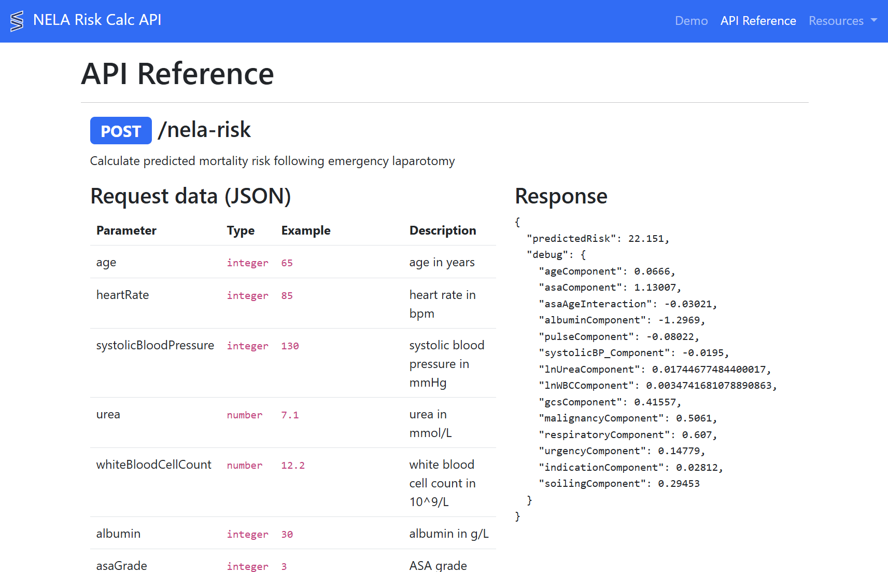
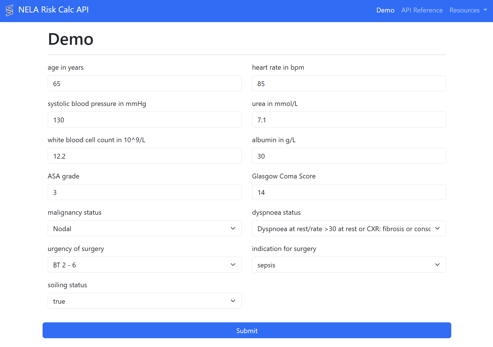

# nela-api


[](https://codecov.io/gh/scatauk/nela-api)
[](https://github.com/scatauk/nela-api/blob/main/LICENSE)

This repository contains an API to generate NELA risk predictions, alongside a simple browser-based demo of its use and API reference documentation:






It will allow a POST request to be sent containing patient data and returns a mortality risk prediction percentage based on the NELA project's risk prediction calculation.  Examples below are provided using curl but the same principles apply whichever API call method is used:

``` bash
curl -sS -X POST http://localhost:3000/nela-risk \
-H "Content-Type: application/json" \
-d '{
    "age": 65,
    "heartRate": 85,
    "systolicBloodPressure": 130,
    "urea": 7.0,
    "whiteBloodCellCount": 12.0,
    "albumin": 30,
    "asaGrade": 3,
    "glasgowComaScore": 14,
    "malignancy": "Nodal",
    "dyspnoea": "Dyspnoea at rest/rate >30 at rest or CXR: fibrosis or consolidation",
    "urgency": "BT 2 - 6",
    "indicationForSurgery": "sepsis",
    "soiling": true
}'
```

returns the morality risk 22.151% plus debugging information:

``` bash
{"predictedRisk":22.151,"debug":{"ageComponent":0.0666,"asaComponent":1.13007,"asaAgeInteraction":-0.03021,"albuminComponent":-1.2969,"pulseComponent":-0.08022,"systolicBP_Component":-0.0195,"lnUreaComponent":0.01744677484400017,"lnWBCComponent":0.0034741681078890863,"gcsComponent":0.41557,"malignancyComponent":0.5061,"respiratoryComponent":0.607,"urgencyComponent":0.14779,"indicationComponent":0.02812,"soilingComponent":0.29453}}
```

For CLI users, this can be piped to jq:

``` bash
curl -sS -X POST http://localhost:3000/nela-risk \
-H "Content-Type: application/json" \
-d '{
    "age": 65,
    "heartRate": 85,
    "systolicBloodPressure": 130,
    "urea": 7.0,
    "whiteBloodCellCount": 12.0,
    "albumin": 30,
    "asaGrade": 3,
    "glasgowComaScore": 14,
    "malignancy": "Nodal",
    "dyspnoea": "Dyspnoea at rest/rate >30 at rest or CXR: fibrosis or consolidation",
    "urgency": "BT 2 - 6",
    "indicationForSurgery": "sepsis",
    "soiling": true
}' | jq
```

to generate a formatted block:

```bash
{
  "predictedRisk": 22.151,
  "debug": {
    "ageComponent": 0.0666,
    "asaComponent": 1.13007,
    "asaAgeInteraction": -0.03021,
    "albuminComponent": -1.2969,
    "pulseComponent": -0.08022,
    "systolicBP_Component": -0.0195,
    "lnUreaComponent": 0.01744677484400017,
    "lnWBCComponent": 0.0034741681078890863,
    "gcsComponent": 0.41557,
    "malignancyComponent": 0.5061,
    "respiratoryComponent": 0.607,
    "urgencyComponent": 0.14779,
    "indicationComponent": 0.02812,
    "soilingComponent": 0.29453
  }
}
```

or just grab the `predictedRisk`:

``` bash
curl -sS -X POST http://localhost:3000/nela-risk \
-H "Content-Type: application/json" \
-d '{
    "age": 65,
    "heartRate": 85,
    "systolicBloodPressure": 130,
    "urea": 7.0,
    "whiteBloodCellCount": 12.0,
    "albumin": 30,
    "asaGrade": 3,
    "glasgowComaScore": 14,
    "malignancy": "Nodal",
    "dyspnoea": "Dyspnoea at rest/rate >30 at rest or CXR: fibrosis or consolidation",
    "urgency": "BT 2 - 6",
    "indicationForSurgery": "sepsis",
    "soiling": true
}' | jq '.predictedRisk'
```

returns:

```bash
22.151
```

## Technology Stack

The API itself runs on nodejs and uses the Express.js framework.  Testing is performed with Vitest and coverage reporting is with Istanbul.  The risk prediction algorithm is run on a dataset, provided by the NELA team, of over 5000 simulated patients which has been created and tested as part of the risk prediction algorithm validation.

Parameters are outlined in `/schema.json` which forms the basis of a front-end, which is provided for demonstration and additional end-to-end testing purposes.  This uses Vue and Bootstrap and testing is with Cypress.

Continuous Integration runners ensure these tests are run with each commit to this repository.

## Development and Usage

### Requirements

Node.js and npm

### Run a local instance

1. Clone repository: `git clone https://github.com/scatauk/nela-api`
2. Install dependencies `npm install`
3. Run development environment `npm run dev`

This will start a backend api on port 3000 which will respond to POST calls to http://localhost/nela-risk and show a front end at http://localhost:3000

### Deployment

Anywhere :)

Docker containers or a server with nodejs available (`pm2` is recommended) are good options.

## Contributions

All contributions welcome.  From pull requests to issues and feedback, this software has been made open source to allow any and all to share and benefit.
